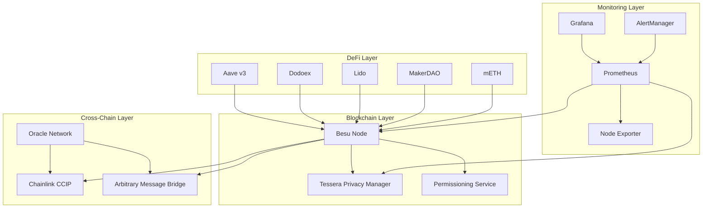
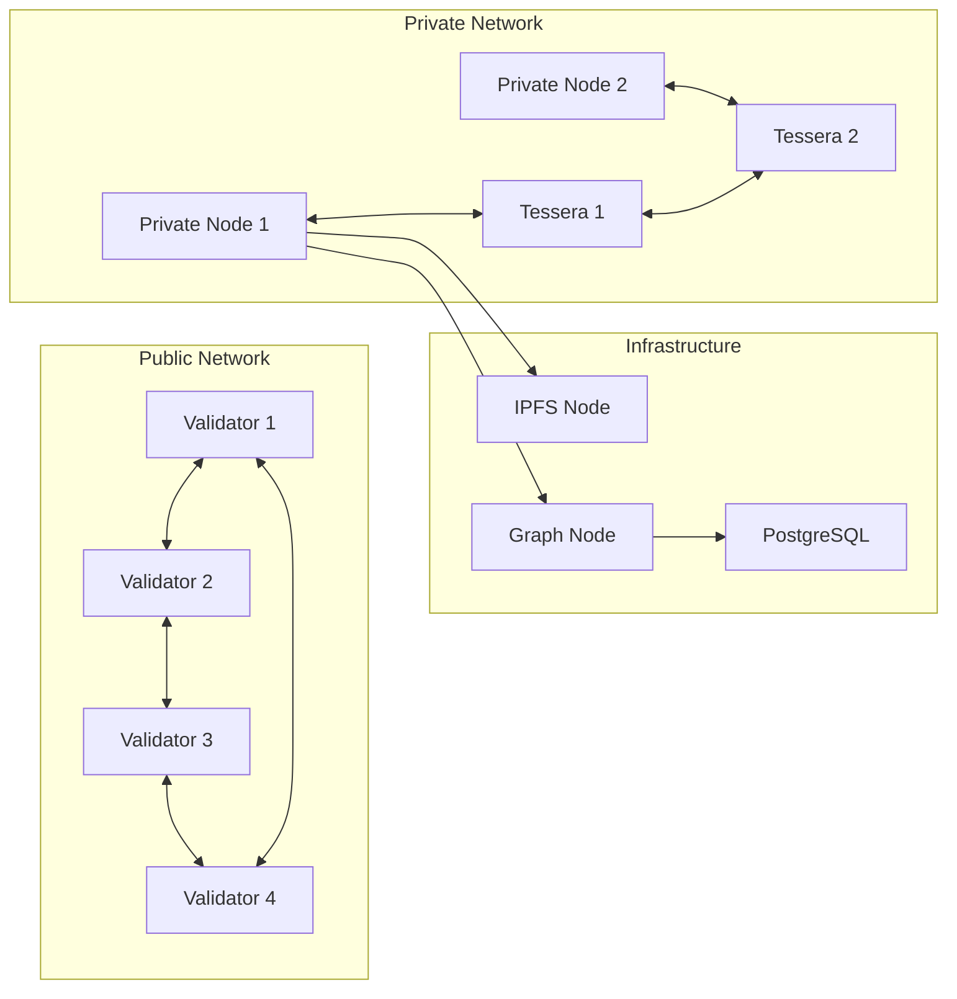
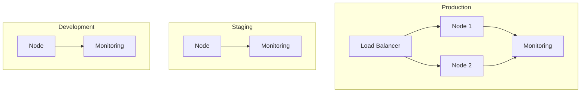

# Chain 138 Architecture

## System Architecture

## Component Interactions

### 1. Blockchain Core
- **Besu Node**: Primary blockchain node running IBFT 2.0 consensus
- **Tessera**: Handles private transactions and privacy group management
- **Permissioning**: Manages node and account access control

### 2. Cross-Chain Infrastructure
- **CCIP**: Handles cross-chain token transfers and message passing
- **AMB**: Manages arbitrary message bridging between chains
- **Oracle Network**: Provides external data and cross-chain validation

### 3. DeFi Protocols
- **Aave v3**: Lending and borrowing protocol
- **Dodoex**: Decentralized exchange with PMM
- **Lido**: Liquid staking protocol
- **MakerDAO**: Stablecoin and CDP system
- **mETH**: Managed ETH staking solution

### 4. Monitoring Stack
- **Prometheus**: Metrics collection and storage
- **Grafana**: Visualization and dashboards
- **AlertManager**: Alert routing and notification
- **Node Exporter**: System metrics collection

## Network Architecture

## Data Flow

### Transaction Flow
1. Public Transactions
   - Submitted to Besu nodes
   - Validated by permissioning service
   - Processed by IBFT consensus
   - Included in blocks

2. Private Transactions
   - Submitted to Tessera
   - Encrypted and distributed to privacy group
   - Private state updated
   - Public hash recorded on chain

### Cross-Chain Operations
1. CCIP Flow
   - Source chain locks tokens
   - CCIP relayers validate
   - Destination chain mints tokens
   - Events emitted and monitored

2. AMB Flow
   - Source chain emits message
   - AMB relayers validate
   - Destination chain executes
   - Status tracked and monitored

## Security Architecture

### Network Security
- TLS encryption for all communications
- Node authentication via certificates
- Private network isolation
- Rate limiting on public endpoints

### Privacy Security
- Zero-knowledge privacy groups
- Private state isolation
- Encrypted P2P communication
- Key rotation policies

### Monitoring Security
- Secure metric collection
- Encrypted alert notifications
- Access control for dashboards
- Audit logging

## Scaling Considerations

### Horizontal Scaling
- Additional validator nodes
- Read replica nodes
- Multiple privacy managers
- Load balanced endpoints

### Vertical Scaling
- Resource allocation
- Database optimization
- Cache configuration
- Network capacity

## Deployment Architecture

