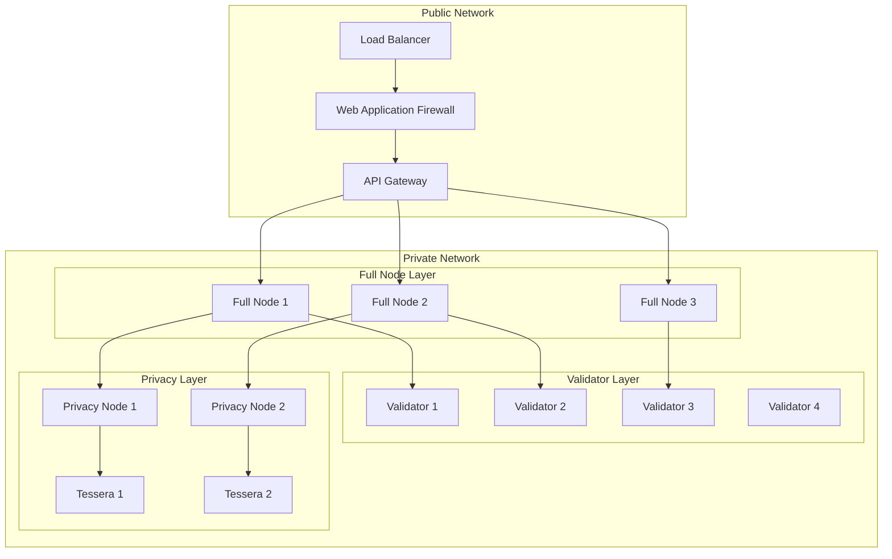

# Network Architecture Guide

## Overview

### Network Components
1. Blockchain Network
   - Validator Nodes
   - Full Nodes
   - Archive Nodes
   - Privacy Nodes

2. Infrastructure Network
   - Load Balancers
   - API Gateways
   - Monitoring Systems
   - Database Clusters

3. Security Network
   - Firewalls
   - VPNs
   - IDS/IPS
   - WAF

## Network Topology

### Core Network


### Network Zones

#### Security Zones
```yaml
# network-zones.yml
zones:
  public:
    description: "Public-facing services"
    components:
      - load_balancers
      - api_gateways
      - waf
    security_level: "high"
    
  private:
    description: "Internal services"
    components:
      - validators
      - full_nodes
      - privacy_nodes
    security_level: "maximum"
    
  management:
    description: "Management services"
    components:
      - monitoring
      - backup
      - admin
    security_level: "high"
```

#### Network Segmentation
```hcl
# terraform/network.tf
resource "aws_vpc" "chain138" {
  cidr_block = "10.0.0.0/16"
  
  tags = {
    Name = "chain138-network"
  }
}

resource "aws_subnet" "public" {
  vpc_id     = aws_vpc.chain138.id
  cidr_block = "10.0.1.0/24"
}

resource "aws_subnet" "private" {
  vpc_id     = aws_vpc.chain138.id
  cidr_block = "10.0.2.0/24"
}

resource "aws_subnet" "management" {
  vpc_id     = aws_vpc.chain138.id
  cidr_block = "10.0.3.0/24"
}
```

## Network Security

### Firewall Configuration

#### Ingress Rules
```bash
#!/bin/bash
# configure-firewall.sh

# Allow SSH only from management network
iptables -A INPUT -p tcp -s 10.0.3.0/24 --dport 22 -j ACCEPT

# Allow P2P traffic between nodes
iptables -A INPUT -p tcp --dport 30303 -j ACCEPT
iptables -A INPUT -p udp --dport 30303 -j ACCEPT

# Allow RPC from API gateway
iptables -A INPUT -p tcp -s 10.0.1.0/24 --dport 8545 -j ACCEPT

# Allow monitoring from management network
iptables -A INPUT -p tcp -s 10.0.3.0/24 --dport 9090 -j ACCEPT
```

#### Security Groups
```yaml
# security-groups.yml
groups:
  validator:
    ingress:
      - port: 30303
        protocol: tcp
        source: validator
      - port: 8545
        protocol: tcp
        source: api_gateway
        
  privacy:
    ingress:
      - port: 9102
        protocol: tcp
        source: privacy
      - port: 8545
        protocol: tcp
        source: api_gateway
        
  monitoring:
    ingress:
      - port: 9090
        protocol: tcp
        source: management
      - port: 3000
        protocol: tcp
        source: management
```

### Access Control

#### Network ACLs
```hcl
# terraform/acl.tf
resource "aws_network_acl" "private" {
  vpc_id = aws_vpc.chain138.id
  
  ingress {
    protocol   = "tcp"
    rule_no    = 100
    action     = "allow"
    cidr_block = "10.0.1.0/24"
    from_port  = 8545
    to_port    = 8545
  }
  
  ingress {
    protocol   = "tcp"
    rule_no    = 200
    action     = "allow"
    cidr_block = "10.0.2.0/24"
    from_port  = 30303
    to_port    = 30303
  }
}
```

#### VPN Configuration
```yaml
# vpn-config.yml
server:
  port: 1194
  protocol: udp
  network: 10.8.0.0
  netmask: 255.255.255.0
  
clients:
  - name: admin
    subnet: 10.8.0.0/24
    routes:
      - network: 10.0.2.0
        netmask: 255.255.255.0
      - network: 10.0.3.0
        netmask: 255.255.255.0
```

## High Availability

### Load Balancing

#### Layer 4 Load Balancing
```yaml
# haproxy.cfg
frontend blockchain_nodes
    bind *:8545
    mode tcp
    default_backend nodes
    
backend nodes
    mode tcp
    balance roundrobin
    option tcp-check
    server node1 10.0.2.10:8545 check
    server node2 10.0.2.11:8545 check
    server node3 10.0.2.12:8545 check
```

#### Layer 7 Load Balancing
```nginx
# nginx.conf
upstream api_servers {
    least_conn;
    server 10.0.1.10:3000;
    server 10.0.1.11:3000;
    server 10.0.1.12:3000;
}

server {
    listen 443 ssl;
    server_name api.chain138.com;
    
    location / {
        proxy_pass http://api_servers;
        proxy_set_header Host $host;
        proxy_set_header X-Real-IP $remote_addr;
    }
}
```

### Failover Configuration

#### Node Failover
```yaml
# failover-config.yml
clusters:
  validator:
    nodes:
      - host: validator1
        priority: 1
      - host: validator2
        priority: 2
      - host: validator3
        priority: 3
    
  privacy:
    nodes:
      - host: privacy1
        priority: 1
      - host: privacy2
        priority: 2
    
monitoring:
  check_interval: 5s
  timeout: 3s
  fall: 3
  rise: 2
```

#### Database Failover
```yaml
# postgresql-ha.conf
primary_conninfo = 'host=10.0.2.20 port=5432 user=replicator password=xxx'
promote_trigger_file = '/var/lib/postgresql/promote'
recovery_target_timeline = 'latest'
recovery_min_apply_delay = 0

# Replication slots
max_replication_slots = 10
max_wal_senders = 10
wal_level = replica
hot_standby = on
```

## Performance Optimization

### Network Optimization

#### TCP Tuning
```bash
#!/bin/bash
# optimize-network.sh

# Increase TCP buffer sizes
sysctl -w net.core.rmem_max=16777216
sysctl -w net.core.wmem_max=16777216
sysctl -w net.ipv4.tcp_rmem="4096 87380 16777216"
sysctl -w net.ipv4.tcp_wmem="4096 87380 16777216"

# Enable TCP BBR
sysctl -w net.core.default_qdisc=fq
sysctl -w net.ipv4.tcp_congestion_control=bbr

# Increase connection backlog
sysctl -w net.core.somaxconn=65535
sysctl -w net.core.netdev_max_backlog=65535
```

#### Network Interface Tuning
```bash
#!/bin/bash
# optimize-interface.sh

# Set interface parameters
ethtool -G eth0 rx 4096 tx 4096
ethtool -K eth0 tso on
ethtool -K eth0 gso on
ethtool -K eth0 gro on

# Set MTU
ip link set eth0 mtu 9000

# Set queue length
ip link set eth0 txqueuelen 10000
```

### Traffic Management

#### Rate Limiting
```nginx
# rate-limit.conf
limit_req_zone $binary_remote_addr zone=api_limit:10m rate=10r/s;
limit_req_zone $binary_remote_addr zone=rpc_limit:10m rate=5r/s;

server {
    location /api/ {
        limit_req zone=api_limit burst=20 nodelay;
        proxy_pass http://api_servers;
    }
    
    location /rpc/ {
        limit_req zone=rpc_limit burst=10 nodelay;
        proxy_pass http://rpc_servers;
    }
}
```

#### Traffic Shaping
```bash
#!/bin/bash
# traffic-shape.sh

# Set up traffic classes
tc qdisc add dev eth0 root handle 1: htb default 30
tc class add dev eth0 parent 1: classid 1:1 htb rate 1000mbit

# Priority traffic (consensus)
tc class add dev eth0 parent 1:1 classid 1:10 htb rate 500mbit ceil 1000mbit prio 1
tc filter add dev eth0 protocol ip parent 1: prio 1 u32 match ip dport 30303 flowid 1:10

# Normal traffic
tc class add dev eth0 parent 1:1 classid 1:20 htb rate 400mbit ceil 800mbit prio 2
tc filter add dev eth0 protocol ip parent 1: prio 2 u32 match ip dport 8545 flowid 1:20
```

## Monitoring

### Network Monitoring

#### Prometheus Configuration
```yaml
# prometheus-network.yml
scrape_configs:
  - job_name: 'network_metrics'
    static_configs:
      - targets:
        - 'node-exporter:9100'
    metrics_path: '/metrics'
    
    relabel_configs:
      - source_labels: [__address__]
        target_label: instance
        replacement: '${1}'
```

#### Network Metrics
```typescript
// network-metrics.ts
const networkMetrics = {
  bandwidth: new Gauge({
    name: 'network_bandwidth_bytes',
    help: 'Network bandwidth usage'
  }),
  
  latency: new Gauge({
    name: 'network_latency_seconds',
    help: 'Network latency between nodes'
  }),
  
  packetLoss: new Gauge({
    name: 'network_packet_loss_ratio',
    help: 'Network packet loss ratio'
  })
};
```

### Alert Configuration

#### Network Alerts
```yaml
# network-alerts.yml
groups:
  - name: network_alerts
    rules:
      - alert: HighLatency
        expr: network_latency_seconds > 0.1
        for: 5m
        labels:
          severity: warning
        annotations:
          summary: High network latency
          
      - alert: PacketLoss
        expr: network_packet_loss_ratio > 0.01
        for: 5m
        labels:
          severity: warning
        annotations:
          summary: Significant packet loss
          
      - alert: BandwidthSaturation
        expr: network_bandwidth_bytes > 900000000
        for: 5m
        labels:
          severity: warning
        annotations:
          summary: Network bandwidth near capacity
```

#### Performance Alerts
```yaml
# performance-alerts.yml
groups:
  - name: performance_alerts
    rules:
      - alert: HighCPUUsage
        expr: node_cpu_usage_ratio > 0.8
        for: 5m
        labels:
          severity: warning
        annotations:
          summary: High CPU usage
          
      - alert: HighMemoryUsage
        expr: node_memory_usage_ratio > 0.8
        for: 5m
        labels:
          severity: warning
        annotations:
          summary: High memory usage
```

## Maintenance

### Network Maintenance

#### Maintenance Procedures
```bash
#!/bin/bash
# network-maintenance.sh

# Backup network configuration
backup_network_config() {
    tar -czf /backup/network/$(date +%Y%m%d).tar.gz \
        /etc/network/ \
        /etc/nginx/ \
        /etc/haproxy/
}

# Update network configuration
update_network_config() {
    # Apply new configuration
    cp /etc/network/interfaces.new /etc/network/interfaces
    systemctl restart networking
    
    # Verify connectivity
    ping -c 3 10.0.2.1 || rollback_network_config
}

# Rollback procedure
rollback_network_config() {
    cp /etc/network/interfaces.backup /etc/network/interfaces
    systemctl restart networking
}
```

#### Upgrade Procedures
```bash
#!/bin/bash
# upgrade-network.sh

# Upgrade network components
upgrade_components() {
    # Update load balancer
    docker-compose -f docker-compose.lb.yml pull
    docker-compose -f docker-compose.lb.yml up -d
    
    # Update API gateway
    docker-compose -f docker-compose.api.yml pull
    docker-compose -f docker-compose.api.yml up -d
    
    # Verify upgrades
    ./scripts/verify-network.sh
}
```

### Documentation

#### Network Documentation
```markdown
# Network Documentation

## Network Diagram
[Include detailed network diagram]

## IP Addressing
- Public Network: 10.0.1.0/24
- Private Network: 10.0.2.0/24
- Management Network: 10.0.3.0/24

## Security
- Firewall rules
- Access controls
- VPN configuration

## Monitoring
- Metrics collection
- Alert configuration
- Performance monitoring

## Maintenance
- Backup procedures
- Upgrade procedures
- Emergency procedures
```

#### Change Management
```yaml
# change-management.yml
changes:
  network_update:
    approval_required: true
    notification_required: true
    rollback_plan_required: true
    maintenance_window_required: true
    
  emergency_change:
    approval_required: false
    notification_required: true
    rollback_plan_required: true
    post_implementation_review: true
``` 