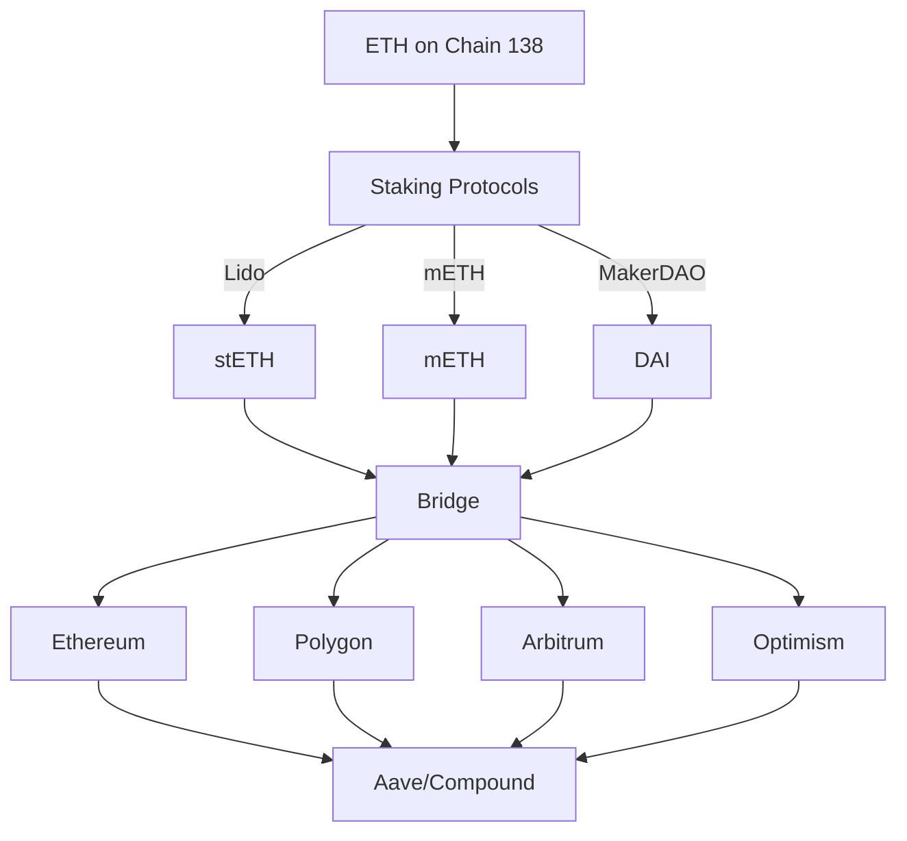

# Cross-Chain Staking and Lending Guide

## Overview
This guide details how to stake ETH from Chain 138 using various protocols (Lido, mETH, MakerDAO) and utilize the staked/wrapped tokens across multiple blockchain networks through Aave and Compound.

## Architecture

### Cross-Chain Flow


## Staking Integration

### Lido Integration
```solidity
// contracts/staking/LidoIntegration.sol
contract LidoIntegration {
    ILido public immutable lido;
    ICCIP public immutable ccip;
    
    constructor(address _lido, address _ccip) {
        lido = ILido(_lido);
        ccip = ICCIP(_ccip);
    }
    
    function stakeAndBridge(
        uint256 amount,
        uint64 destinationChainSelector,
        address receiver
    ) external payable {
        // Stake ETH and receive stETH
        uint256 stETHAmount = lido.submit{value: amount}(address(0));
        
        // Bridge stETH to destination chain
        bytes memory data = abi.encode(stETHAmount, receiver);
        ccip.sendTokensWithData(
            destinationChainSelector,
            receiver,
            IERC20(address(lido)),
            stETHAmount,
            data
        );
    }
}
```

### mETH Integration
```solidity
// contracts/staking/ManagedEthIntegration.sol
contract ManagedEthIntegration {
    IManagedEth public immutable meth;
    ICCIP public immutable ccip;
    
    constructor(address _meth, address _ccip) {
        meth = IManagedEth(_meth);
        ccip = ICCIP(_ccip);
    }
    
    function stakeAndBridge(
        uint256 amount,
        uint64 destinationChainSelector,
        address receiver
    ) external payable {
        // Stake ETH and receive mETH
        uint256 mETHAmount = meth.deposit{value: amount}();
        
        // Bridge mETH to destination chain
        bytes memory data = abi.encode(mETHAmount, receiver);
        ccip.sendTokensWithData(
            destinationChainSelector,
            receiver,
            IERC20(address(meth)),
            mETHAmount,
            data
        );
    }
}
```

### MakerDAO Integration
```solidity
// contracts/staking/MakerIntegration.sol
contract MakerIntegration {
    IMakerDAO public immutable maker;
    ICCIP public immutable ccip;
    
    constructor(address _maker, address _ccip) {
        maker = IMakerDAO(_maker);
        ccip = ICCIP(_ccip);
    }
    
    function lockAndBridge(
        uint256 amount,
        uint256 daiAmount,
        uint64 destinationChainSelector,
        address receiver
    ) external payable {
        // Lock ETH and mint DAI
        maker.lockETH{value: amount}();
        maker.drawDAI(daiAmount);
        
        // Bridge DAI to destination chain
        bytes memory data = abi.encode(daiAmount, receiver);
        ccip.sendTokensWithData(
            destinationChainSelector,
            receiver,
            IERC20(maker.dai()),
            daiAmount,
            data
        );
    }
}
```

## Cross-Chain Bridge Configuration

### CCIP Router Setup
```solidity
// contracts/bridge/CCIPRouter.sol
contract CCIPRouter {
    mapping(uint64 => address) public destinationStakingContracts;
    mapping(address => bool) public supportedTokens;
    
    function addDestinationContract(
        uint64 chainSelector,
        address stakingContract
    ) external onlyOwner {
        destinationStakingContracts[chainSelector] = stakingContract;
    }
    
    function addSupportedToken(
        address token
    ) external onlyOwner {
        supportedTokens[token] = true;
    }
    
    function _ccipReceive(
        Client.Any2EVMMessage memory message
    ) internal override {
        // Handle incoming bridged tokens
        address token = message.tokenAmounts[0].token;
        uint256 amount = message.tokenAmounts[0].amount;
        address receiver = abi.decode(message.data, (address));
        
        // Forward tokens to Aave/Compound integration
        IERC20(token).approve(destinationStakingContracts[message.sourceChainSelector], amount);
        ILendingProtocol(destinationStakingContracts[message.sourceChainSelector])
            .deposit(token, amount, receiver);
    }
}
```

## Lending Protocol Integration

### Aave Integration
```solidity
// contracts/lending/AaveIntegration.sol
contract AaveIntegration {
    ILendingPool public immutable lendingPool;
    
    constructor(address _lendingPool) {
        lendingPool = ILendingPool(_lendingPool);
    }
    
    function deposit(
        address token,
        uint256 amount,
        address onBehalfOf
    ) external {
        // Deposit bridged tokens into Aave
        lendingPool.deposit(
            token,
            amount,
            onBehalfOf,
            0 // referralCode
        );
    }
    
    function borrow(
        address token,
        uint256 amount,
        uint256 interestRateMode,
        address onBehalfOf
    ) external {
        // Borrow against deposited collateral
        lendingPool.borrow(
            token,
            amount,
            interestRateMode,
            0, // referralCode
            onBehalfOf
        );
    }
}
```

### Compound Integration
```solidity
// contracts/lending/CompoundIntegration.sol
contract CompoundIntegration {
    IComptroller public immutable comptroller;
    
    constructor(address _comptroller) {
        comptroller = IComptroller(_comptroller);
    }
    
    function deposit(
        address token,
        uint256 amount,
        address onBehalfOf
    ) external {
        // Enter markets if needed
        address[] memory markets = new address[](1);
        markets[0] = token;
        comptroller.enterMarkets(markets);
        
        // Deposit bridged tokens into Compound
        ICToken(token).mint(amount);
    }
    
    function borrow(
        address token,
        uint256 amount,
        address onBehalfOf
    ) external {
        // Borrow against deposited collateral
        ICToken(token).borrow(amount);
    }
}
```

## Configuration

### Network Configuration
```yaml
# config/networks.yaml
networks:
  chain138:
    rpc_url: http://localhost:8545
    chain_id: 138
    
  ethereum:
    rpc_url: https://eth-mainnet.g.alchemy.com/v2/YOUR-API-KEY
    chain_id: 1
    
  polygon:
    rpc_url: https://polygon-rpc.com
    chain_id: 137
    
  arbitrum:
    rpc_url: https://arb1.arbitrum.io/rpc
    chain_id: 42161
    
  optimism:
    rpc_url: https://mainnet.optimism.io
    chain_id: 10
```

### Protocol Configuration
```yaml
# config/protocols.yaml
staking:
  lido:
    chain138_address: "0x..."
    ethereum_address: "0xae7ab96520DE3A18E5e111B5EaAb095312D7fE84"
    
  meth:
    chain138_address: "0x..."
    ethereum_address: "0x..."
    
  maker:
    chain138_address: "0x..."
    ethereum_address: "0x..."

lending:
  aave:
    ethereum:
      lending_pool: "0x..."
      data_provider: "0x..."
    polygon:
      lending_pool: "0x..."
      data_provider: "0x..."
    
  compound:
    ethereum:
      comptroller: "0x..."
    polygon:
      comptroller: "0x..."
```

## Deployment Steps

1. Deploy Staking Contracts:
```bash
# Deploy staking contracts on Chain 138
npx hardhat run scripts/deploy-staking.ts --network chain138
```

2. Deploy Bridge Contracts:
```bash
# Deploy CCIP contracts on all networks
npx hardhat run scripts/deploy-bridge.ts --network chain138
npx hardhat run scripts/deploy-bridge.ts --network ethereum
npx hardhat run scripts/deploy-bridge.ts --network polygon
```

3. Deploy Lending Integration:
```bash
# Deploy lending integration on destination chains
npx hardhat run scripts/deploy-lending.ts --network ethereum
npx hardhat run scripts/deploy-lending.ts --network polygon
```

## Monitoring

### Metrics
```yaml
# monitoring/prometheus-rules.yaml
groups:
  - name: staking_metrics
    rules:
      - record: staking_total_value_locked
        expr: sum(staking_balance) by (protocol)
      
      - record: bridge_transfer_volume
        expr: sum(rate(bridge_transfers_total[24h])) by (destination_chain)
      
      - record: lending_utilization
        expr: lending_borrowed / lending_supplied
```

### Alerts
```yaml
# monitoring/alert-rules.yaml
groups:
  - name: staking_alerts
    rules:
      - alert: HighStakingUtilization
        expr: staking_utilization > 0.9
        for: 15m
        labels:
          severity: warning
          
      - alert: BridgeTransferDelay
        expr: bridge_transfer_delay > 3600
        for: 5m
        labels:
          severity: critical
```

## Security Considerations

1. **Staking Security**
   - Implement withdrawal limits
   - Add emergency pause functionality
   - Regular audits of staking contracts

2. **Bridge Security**
   - Multi-signature control for bridge operations
   - Rate limiting for large transfers
   - Cross-chain message verification

3. **Lending Security**
   - Collateral health monitoring
   - Liquidation protection mechanisms
   - Interest rate risk management

## Error Handling

```solidity
// contracts/utils/ErrorHandler.sol
contract ErrorHandler {
    event StakingError(
        address indexed user,
        string error
    );
    
    event BridgeError(
        uint64 destinationChainSelector,
        string error
    );
    
    event LendingError(
        address indexed token,
        string error
    );
    
    modifier handleStakingErrors() {
        try {
            _;
        } catch Error(string memory error) {
            emit StakingError(msg.sender, error);
            revert(error);
        }
    }
    
    modifier handleBridgeErrors(uint64 destinationChainSelector) {
        try {
            _;
        } catch Error(string memory error) {
            emit BridgeError(destinationChainSelector, error);
            revert(error);
        }
    }
}
``` 