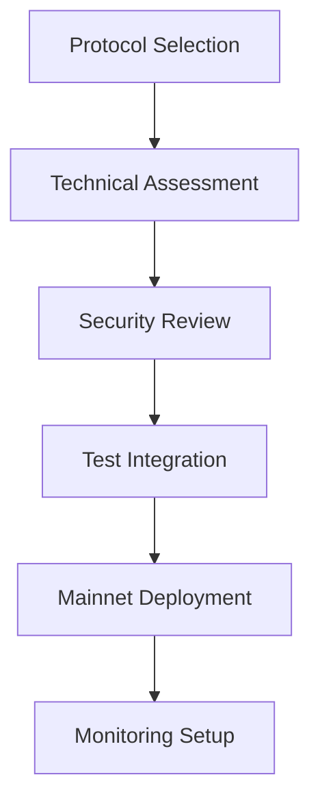
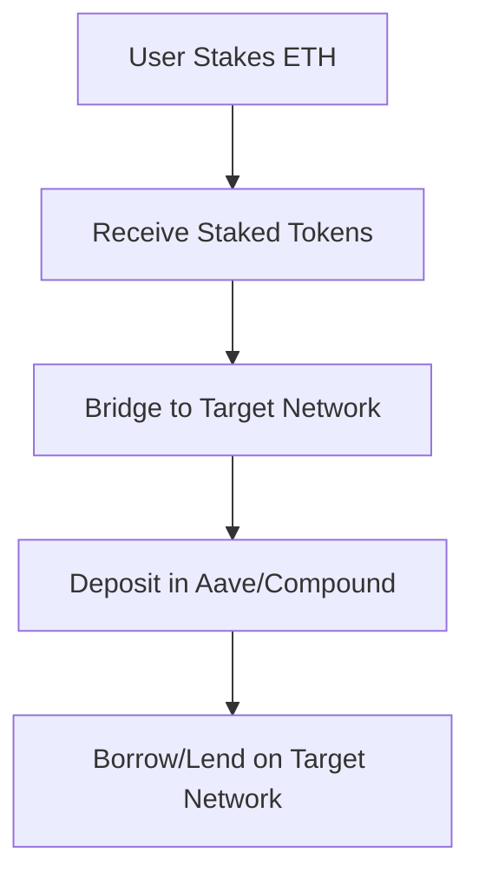

# DeFi Protocols Guide

## Overview

### Supported Protocols
1. Lending Protocols
   - Aave v3
   - Compound v3
   - Euler Finance
2. DEX Protocols
   - Uniswap v3
   - Curve v2
   - Balancer v2
3. Derivatives
   - Perpetual Protocol
   - dYdX v4
4. Options
   - Opyn v2
   - Hegic v2
5. Cross-Chain Staking & Lending
   - Lido (stETH)
   - mETH
   - MakerDAO (DAI)
   - Cross-chain Aave/Compound integration

## Protocol Integration

### Integration Process


### Protocol Requirements
```yaml
# protocol-requirements.yml
general:
  audit_required: true
  documentation_required: true
  test_coverage_minimum: 95%
  
technical:
  solidity_version: ">=0.8.0"
  upgradeable: true
  access_control: true
  emergency_procedures: true
  
operational:
  monitoring_required: true
  alerts_required: true
  backup_procedures: true
```

## Protocol Configuration

### Lending Protocol
```solidity
// LendingConfig.sol
contract LendingConfiguration {
    struct ProtocolConfig {
        uint256 maxLTV;
        uint256 liquidationThreshold;
        uint256 liquidationBonus;
        uint256 borrowingEnabled;
        uint256 flashLoanEnabled;
    }
    
    function configureProtocol(
        address protocol,
        ProtocolConfig memory config
    ) external onlyAdmin {
        // Implementation
    }
}
```

### DEX Protocol
```solidity
// DEXConfig.sol
contract DEXConfiguration {
    struct PoolConfig {
        uint24 fee;
        int24 tickSpacing;
        uint256 maxLiquidity;
    }
    
    function configurePool(
        address pool,
        PoolConfig memory config
    ) external onlyAdmin {
        // Implementation
    }
}
```

## Protocol Security

### Security Checklist
```typescript
// security-checklist.ts
interface SecurityCheck {
  category: string;
  requirement: string;
  status: 'passed' | 'failed' | 'pending';
  notes: string;
}

const securityChecks: SecurityCheck[] = [
  {
    category: 'Access Control',
    requirement: 'Role-based access control implemented',
    status: 'pending',
    notes: 'Verify admin roles configuration'
  },
  {
    category: 'Value Handling',
    requirement: 'Safe math operations used',
    status: 'pending',
    notes: 'Check for overflow protection'
  }
];
```

### Risk Assessment
```typescript
// risk-assessment.ts
interface RiskAssessment {
  protocol: string;
  category: string;
  severity: 'low' | 'medium' | 'high';
  likelihood: 'low' | 'medium' | 'high';
  impact: string;
  mitigation: string;
}

const protocolRisks: RiskAssessment[] = [
  {
    protocol: 'LendingProtocol',
    category: 'Economic',
    severity: 'high',
    likelihood: 'medium',
    impact: 'Potential bad debt accumulation',
    mitigation: 'Implement strict collateral requirements'
  }
];
```

## Protocol Monitoring

### Metrics Collection
```typescript
// protocol-metrics.ts
const defiMetrics = {
  tvl: new Gauge({
    name: 'defi_tvl_total',
    help: 'Total Value Locked across all protocols'
  }),
  
  volume: new Counter({
    name: 'defi_volume_total',
    help: 'Trading volume across all DEX protocols'
  }),
  
  utilization: new Gauge({
    name: 'lending_utilization_ratio',
    help: 'Utilization ratio of lending protocols'
  })
};
```

### Alert Rules
```yaml
# defi-alerts.yml
groups:
  - name: defi_alerts
    rules:
      - alert: HighUtilization
        expr: lending_utilization_ratio > 0.8
        for: 5m
        labels:
          severity: warning
        annotations:
          summary: High lending protocol utilization
          
      - alert: LowLiquidity
        expr: dex_liquidity_ratio < 0.2
        for: 5m
        labels:
          severity: warning
        annotations:
          summary: Low DEX liquidity detected
```

## Protocol Testing

### Integration Tests
```typescript
// integration-tests.ts
describe('Protocol Integration', () => {
  let lending: LendingProtocol;
  let dex: DEXProtocol;
  
  beforeEach(async () => {
    lending = await deployLendingProtocol();
    dex = await deployDEXProtocol();
  });
  
  it('should handle cross-protocol interactions', async () => {
    // Deposit collateral
    await lending.deposit(collateral);
    
    // Borrow assets
    await lending.borrow(amount);
    
    // Trade on DEX
    await dex.swap(tokenIn, tokenOut, amount);
    
    // Verify positions
    expect(await lending.getPosition(user))
      .to.deep.equal(expectedPosition);
  });
});
```

### Stress Tests
```typescript
// stress-tests.ts
describe('Protocol Stress Tests', () => {
  it('should handle high volume', async () => {
    for (let i = 0; i < 1000; i++) {
      await protocol.processTransaction({
        amount: randomAmount(),
        type: randomOperation()
      });
    }
    
    expect(await protocol.getState())
      .to.deep.equal(expectedState);
  });
  
  it('should handle market volatility', async () => {
    // Simulate price changes
    await mockOracle.setPrice(newPrice);
    
    // Verify protocol stability
    expect(await protocol.isStable())
      .to.be.true;
  });
});
```

## Protocol Maintenance

### Parameter Updates
```solidity
// ParameterManager.sol
contract ParameterManager {
    struct Parameters {
        uint256 interestRate;
        uint256 collateralFactor;
        uint256 liquidationIncentive;
    }
    
    function updateParameters(
        address protocol,
        Parameters calldata params
    ) external onlyAdmin {
        require(
            validateParameters(params),
            "Invalid parameters"
        );
        
        IProtocol(protocol).setParameters(params);
        emit ParametersUpdated(protocol, params);
    }
}
```

### Protocol Upgrades
```typescript
// protocol-upgrade.ts
async function upgradeProtocol(
  protocol: string
): Promise<void> {
  // Deploy new implementation
  const newImpl = await deployImplementation();
  
  // Prepare upgrade
  const proxy = await getProxyAdmin(protocol);
  
  // Execute upgrade
  await proxy.upgrade(protocol, newImpl.address);
  
  // Verify upgrade
  await verifyUpgrade(protocol, newImpl);
}
```

## Best Practices

### Code Standards
```solidity
// BestPractices.sol
contract BestPractices {
    // Use descriptive names
    uint256 public constant MAX_TOKENS = 1000000;
    
    // Implement checks
    modifier validAmount(uint256 amount) {
        require(amount > 0, "Invalid amount");
        require(
            amount <= MAX_TOKENS,
            "Exceeds maximum"
        );
        _;
    }
    
    // Use events for important state changes
    event ConfigurationChanged(
        address indexed protocol,
        bytes32 indexed parameter,
        uint256 value
    );
}
```

### Documentation Standards
```solidity
/// @title Protocol Interface
/// @notice Defines core protocol functionality
/// @dev Implement this for protocol integration
interface IProtocol {
    /// @notice Protocol configuration
    /// @param config Configuration parameters
    /// @return success True if configuration successful
    function configure(
        Config calldata config
    ) external returns (bool success);
    
    /// @notice Protocol operation
    /// @param params Operation parameters
    /// @return result Operation result
    function execute(
        Params calldata params
    ) external returns (bytes memory result);
}
```

## Cross-Chain Staking & Lending

### Overview
Chain 138 supports cross-chain staking and lending functionality, allowing users to:
1. Stake ETH using various protocols (Lido, mETH, MakerDAO)
2. Bridge staked tokens to other networks
3. Use staked tokens as collateral on Aave/Compound across multiple networks

For detailed implementation and configuration, see [Cross-Chain Staking Guide](cross-chain-staking.md).

### Supported Networks
- Ethereum Mainnet
- Polygon
- Arbitrum
- Optimism

### Integration Process
