# Troubleshooting Decision Trees

## Node Issues

### Node Not Starting
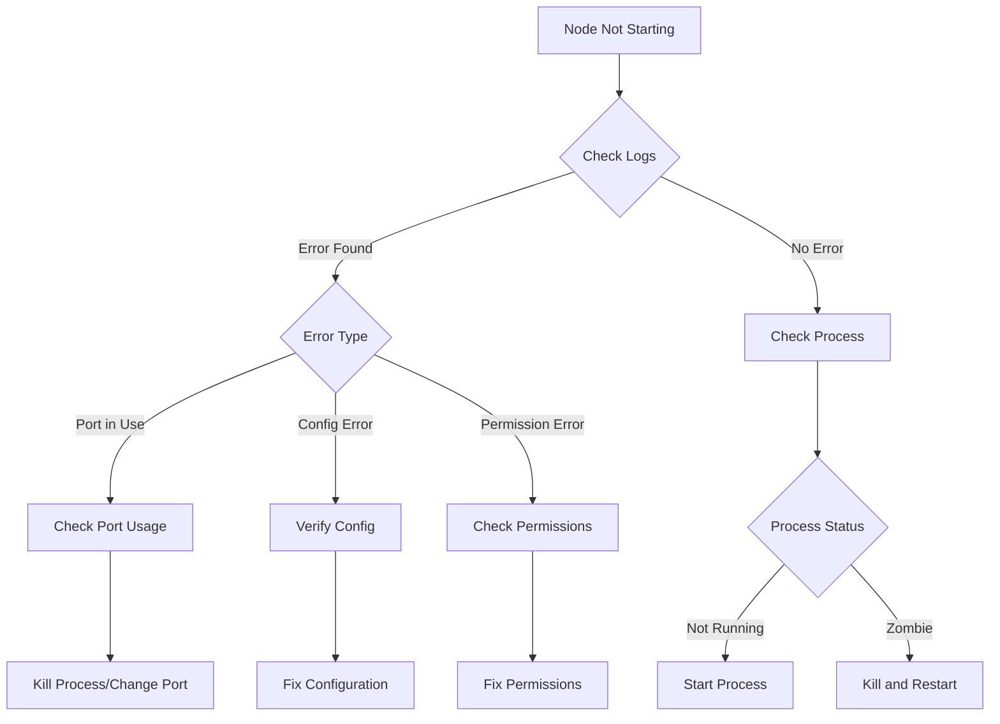
```mermaid
graph TD
    A[Node Not Starting] --> B{Check Logs}
    B -->|Error Found| C{Error Type}
    B -->|No Error| D[Check Process]
    
    C -->|Port in Use| E[Check Port Usage]
    C -->|Config Error| F[Verify Config]
    C -->|Permission Error| G[Check Permissions]
    
    E --> H[Kill Process/Change Port]
    F --> I[Fix Configuration]
    G --> J[Fix Permissions]
    
    D --> K{Process Status}
    K -->|Not Running| L[Start Process]
    K -->|Zombie| M[Kill and Restart]
```

### Consensus Issues
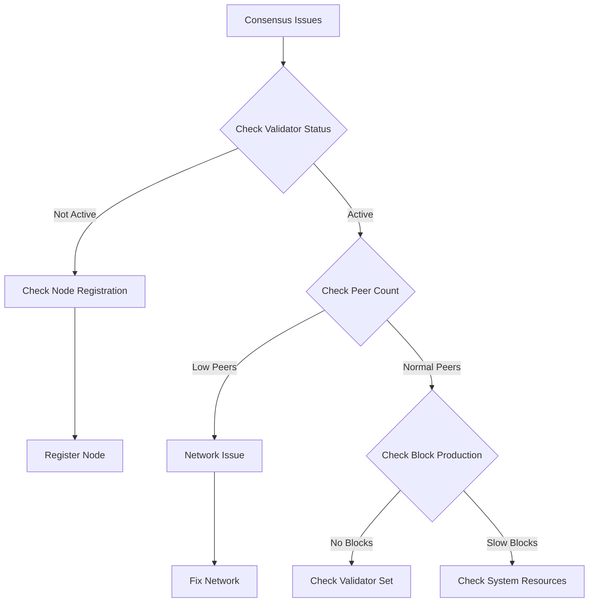
```mermaid
graph TD
    A[Consensus Issues] --> B{Check Validator Status}
    B -->|Not Active| C[Check Node Registration]
    B -->|Active| D{Check Peer Count}
    
    C --> E[Register Node]
    D -->|Low Peers| F[Network Issue]
    D -->|Normal Peers| G{Check Block Production}
    
    F --> H[Fix Network]
    G -->|No Blocks| I[Check Validator Set]
    G -->|Slow Blocks| J[Check System Resources]
```

## Protocol Issues

### DeFi Protocol Failures
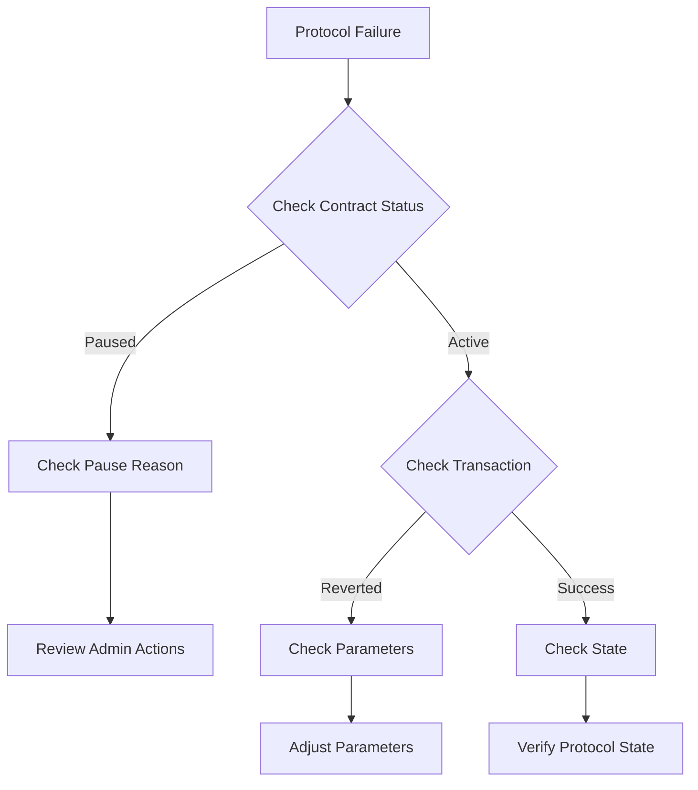
```mermaid
graph TD
    A[Protocol Failure] --> B{Check Contract Status}
    B -->|Paused| C[Check Pause Reason]
    B -->|Active| D{Check Transaction}
    
    C --> E[Review Admin Actions]
    D -->|Reverted| F[Check Parameters]
    D -->|Success| G[Check State]
    
    F --> H[Adjust Parameters]
    G --> I[Verify Protocol State]
```

### Bridge Issues
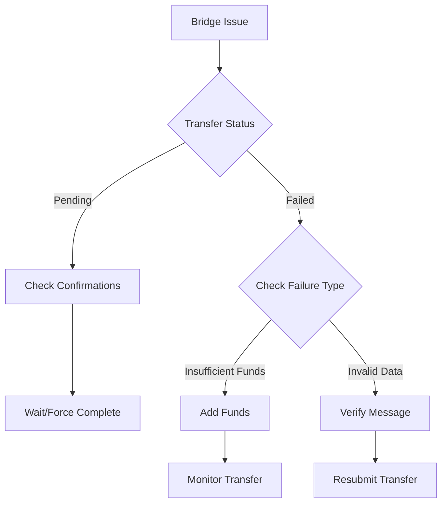
```mermaid
graph TD
    A[Bridge Issue] --> B{Transfer Status}
    B -->|Pending| C[Check Confirmations]
    B -->|Failed| D{Check Failure Type}
    
    C --> E[Wait/Force Complete]
    D -->|Insufficient Funds| F[Add Funds]
    D -->|Invalid Data| G[Verify Message]
    
    F --> H[Monitor Transfer]
    G --> I[Resubmit Transfer]
```

## Privacy Issues

### Privacy Group Problems
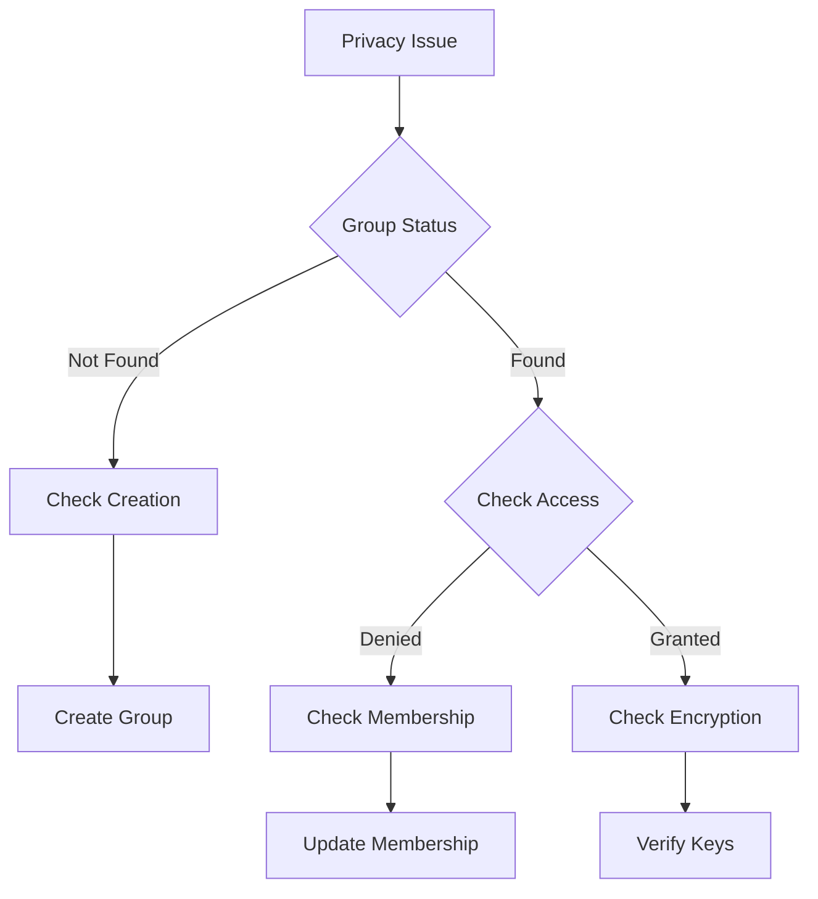
```mermaid
graph TD
    A[Privacy Issue] --> B{Group Status}
    B -->|Not Found| C[Check Creation]
    B -->|Found| D{Check Access}
    
    C --> E[Create Group]
    D -->|Denied| F[Check Membership]
    D -->|Granted| G[Check Encryption]
    
    F --> H[Update Membership]
    G --> I[Verify Keys]
```

### Private Transaction Issues
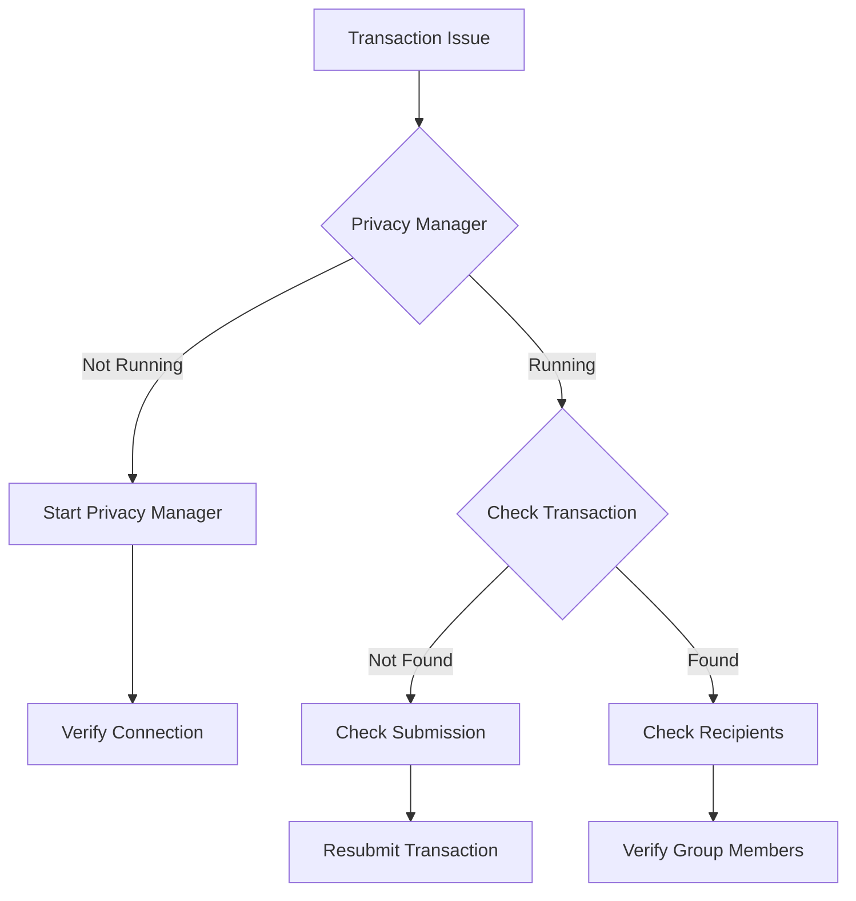
```mermaid
graph TD
    A[Transaction Issue] --> B{Privacy Manager}
    B -->|Not Running| C[Start Privacy Manager]
    B -->|Running| D{Check Transaction}
    
    C --> E[Verify Connection]
    D -->|Not Found| F[Check Submission]
    D -->|Found| G[Check Recipients]
    
    F --> H[Resubmit Transaction]
    G --> I[Verify Group Members]
```

## Performance Issues

### High Resource Usage
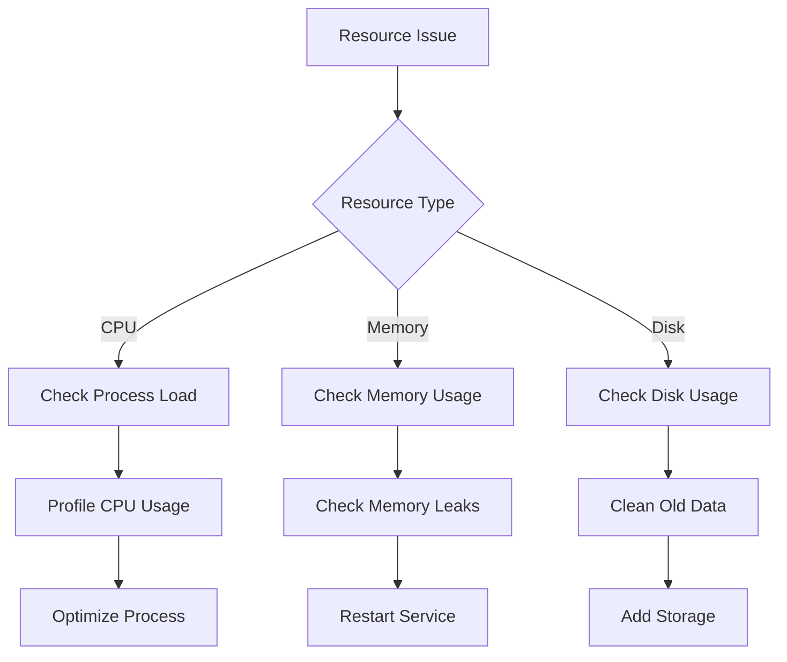
```mermaid
graph TD
    A[Resource Issue] --> B{Resource Type}
    B -->|CPU| C[Check Process Load]
    B -->|Memory| D[Check Memory Usage]
    B -->|Disk| E[Check Disk Usage]
    
    C --> F[Profile CPU Usage]
    D --> G[Check Memory Leaks]
    E --> H[Clean Old Data]
    
    F --> I[Optimize Process]
    G --> J[Restart Service]
    H --> K[Add Storage]
```

### Network Performance
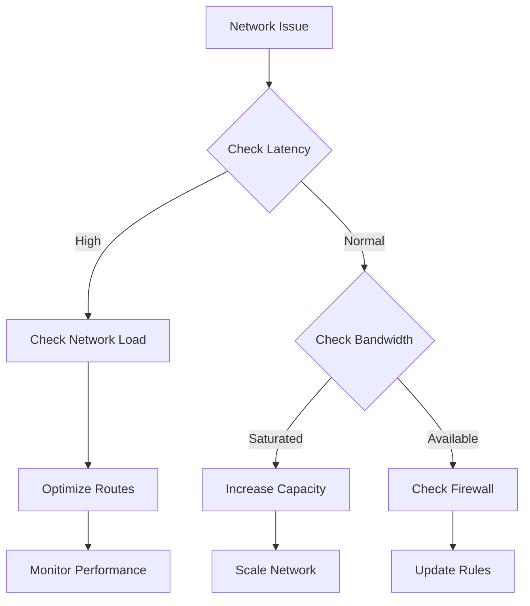
```mermaid
graph TD
    A[Network Issue] --> B{Check Latency}
    B -->|High| C[Check Network Load]
    B -->|Normal| D{Check Bandwidth}
    
    C --> E[Optimize Routes]
    D -->|Saturated| F[Increase Capacity]
    D -->|Available| G[Check Firewall]
    
    E --> H[Monitor Performance]
    F --> I[Scale Network]
    G --> J[Update Rules]
```

## Security Issues

### Access Control Problems
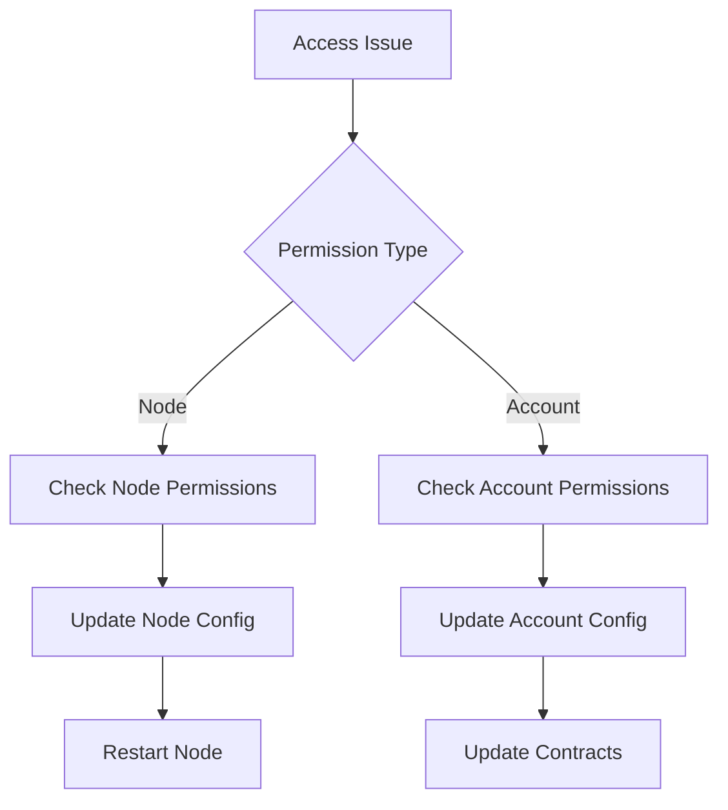
```mermaid
graph TD
    A[Access Issue] --> B{Permission Type}
    B -->|Node| C[Check Node Permissions]
    B -->|Account| D[Check Account Permissions]
    
    C --> E[Update Node Config]
    D --> F[Update Account Config]
    
    E --> G[Restart Node]
    F --> H[Update Contracts]
```

### Security Incidents
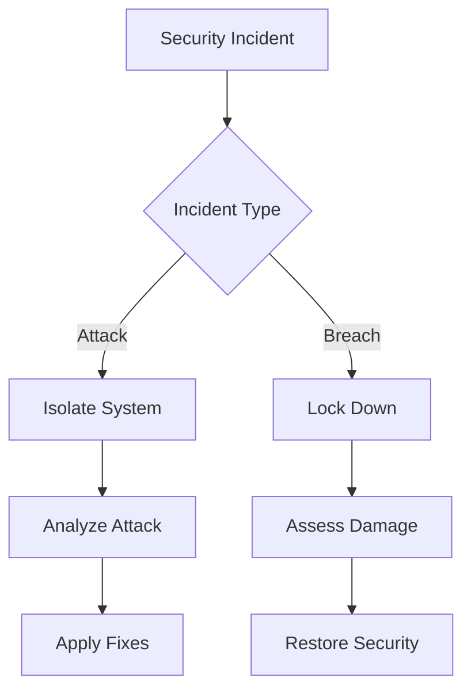
```mermaid
graph TD
    A[Security Incident] --> B{Incident Type}
    B -->|Attack| C[Isolate System]
    B -->|Breach| D[Lock Down]
    
    C --> E[Analyze Attack]
    D --> F[Assess Damage]
    
    E --> G[Apply Fixes]
    F --> H[Restore Security]
```

## Monitoring Issues

### Alert Problems
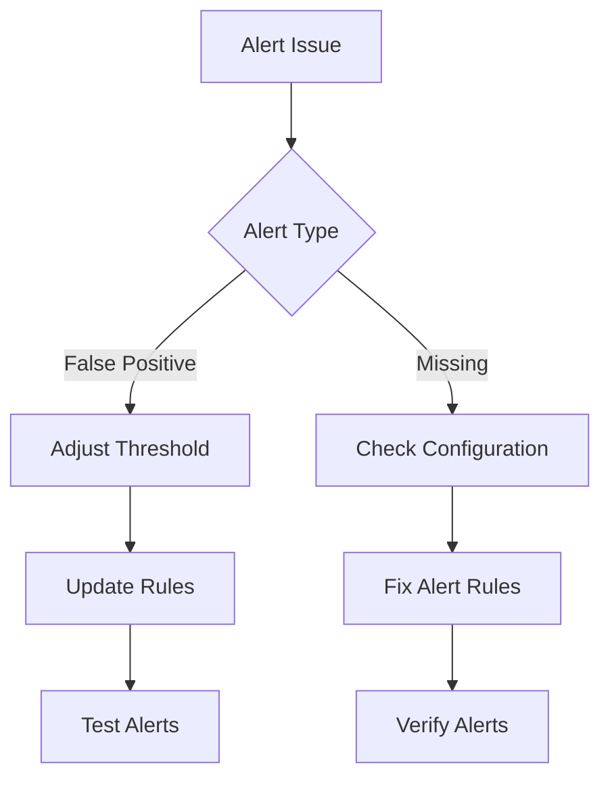
```mermaid
graph TD
    A[Alert Issue] --> B{Alert Type}
    B -->|False Positive| C[Adjust Threshold]
    B -->|Missing| D[Check Configuration]
    
    C --> E[Update Rules]
    D --> F[Fix Alert Rules]
    
    E --> G[Test Alerts]
    F --> H[Verify Alerts]
```

### Metric Collection
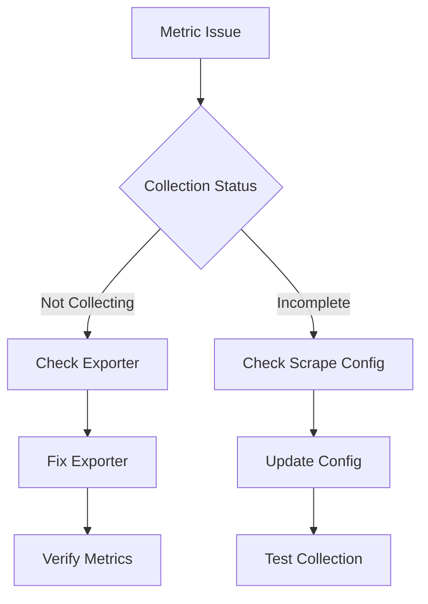
```mermaid
graph TD
    A[Metric Issue] --> B{Collection Status}
    B -->|Not Collecting| C[Check Exporter]
    B -->|Incomplete| D[Check Scrape Config]
    
    C --> E[Fix Exporter]
    D --> F[Update Config]
    
    E --> G[Verify Metrics]
    F --> H[Test Collection]
```

## Recovery Procedures

### System Recovery
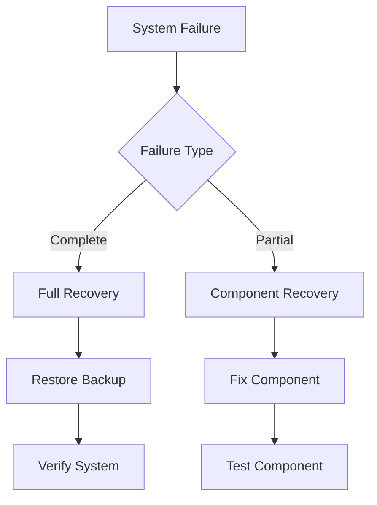
```mermaid
graph TD
    A[System Failure] --> B{Failure Type}
    B -->|Complete| C[Full Recovery]
    B -->|Partial| D[Component Recovery]
    
    C --> E[Restore Backup]
    D --> F[Fix Component]
    
    E --> G[Verify System]
    F --> H[Test Component]
```

### Data Recovery
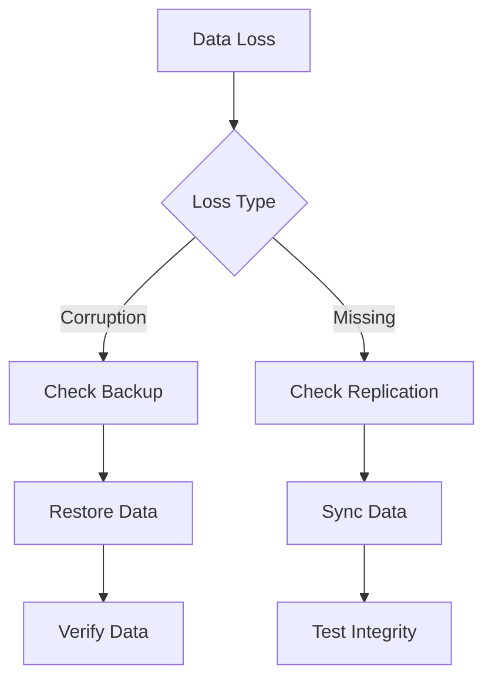
```mermaid
graph TD
    A[Data Loss] --> B{Loss Type}
    B -->|Corruption| C[Check Backup]
    B -->|Missing| D[Check Replication]
    
    C --> E[Restore Data]
    D --> F[Sync Data]
    
    E --> G[Verify Data]
    F --> H[Test Integrity]
```

## Emergency Response

### Critical Failures
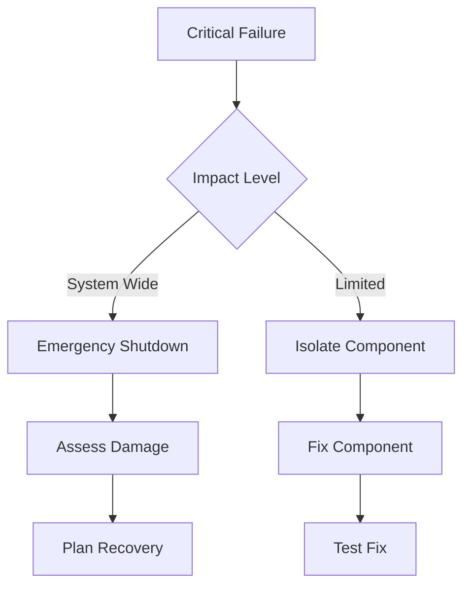
```mermaid
graph TD
    A[Critical Failure] --> B{Impact Level}
    B -->|System Wide| C[Emergency Shutdown]
    B -->|Limited| D[Isolate Component]
    
    C --> E[Assess Damage]
    D --> F[Fix Component]
    
    E --> G[Plan Recovery]
    F --> H[Test Fix]
```

### Service Restoration
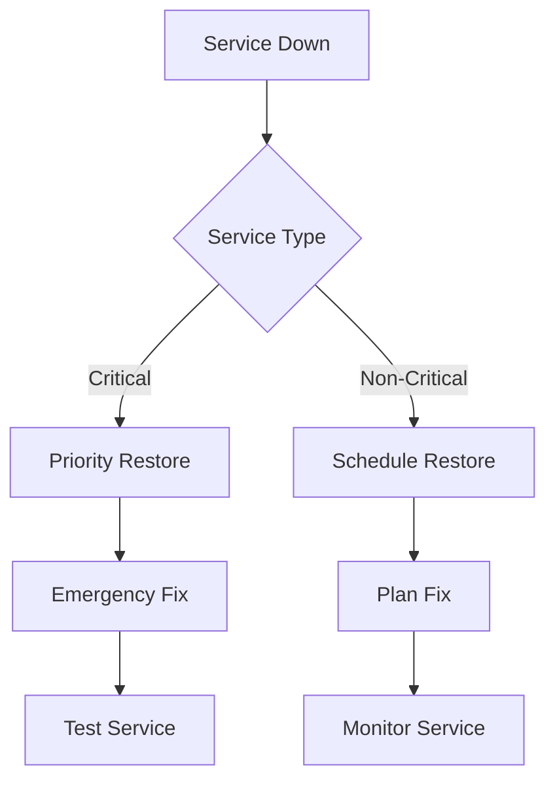
```mermaid
graph TD
    A[Service Down] --> B{Service Type}
    B -->|Critical| C[Priority Restore]
    B -->|Non-Critical| D[Schedule Restore]
    
    C --> E[Emergency Fix]
    D --> F[Plan Fix]
    
    E --> G[Test Service]
    F --> H[Monitor Service]
``` 